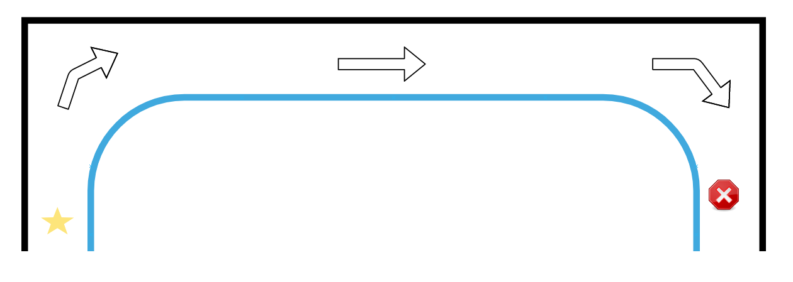
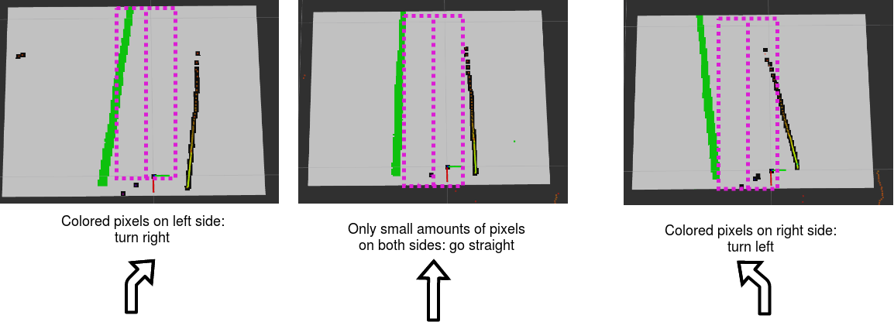

# Line and Wall Following

**Your Task**: Beginning at one side of the course. Travel to the other without hitting any walls or crossing the blue tape. You do not need to detect signs.

**Details:**

  1. Download and calibrate the [birds_eye](https://github.com/nick-paul/birds_eye_view) package. Calibration/configuration instructions are [here](https://youtu.be/uj6eqsdXZck)
  2. Download this assignment into your ROS workspace.
  3. Add your code to the `gridCallback` function in `grid_follow.cpp`

## Hints / Suggested Algorithm Design

Below is an example algorithm that can be used to solve this task. *Note that you do not have to solve the problem this way and may use any algorithm you like*

 1. Divide the grid into thirds (similar to the lane follow problem).
 2. Divide the middle section into halves
 3. If a certain number of non-zero pixels enter into one of the two halves, turn the opposite direction. Essentially, try to keep filled spaces away from the center of the grid (where your robot will be traveling)

